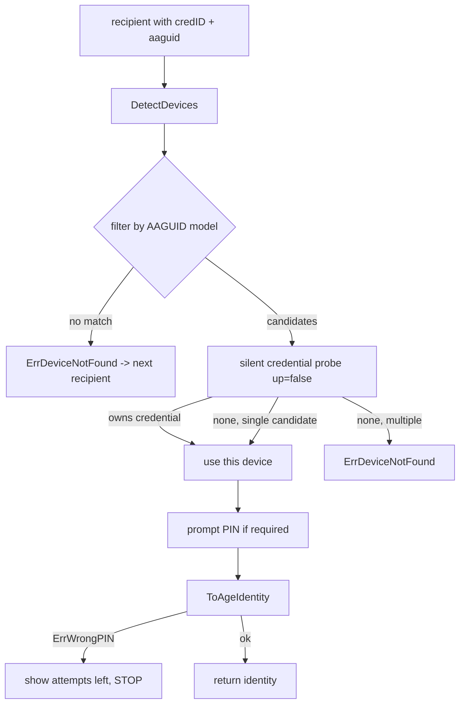

# FIDO2 Support Internals

This document describes how *confcrypt* derives an [age](https://github.com/FiloSottile/age)-compatible
X25519 key from a FIDO2 authenticator using the `hmac-secret` extension, how that
key is encoded into a recipient, and how the right physical device is selected at
decryption time.

FIDO2 support requires a CGO build with `libfido2`. See the
[FIDO2 Support](README.md#fido2-support) section of the README for build and usage
instructions.

## Why FIDO2 / hmac-secret

The [`hmac-secret`](https://fidoalliance.org/specs/fido-v2.1-ps-20210615/fido-client-to-authenticator-protocol-v2.1-ps-20210615.html#sctn-hmac-secret-extension)
extension lets an authenticator return a deterministic secret derived from a
per-credential key and a caller-supplied salt:

```
hmac_secret = HMAC-SHA256(credential_key, salt)
```

Properties we rely on:

- **Deterministic**: the same `(credential, salt)` always yields the same secret,
  so the same age key can be re-derived on demand.
- **Device-bound**: `credential_key` never leaves the authenticator. We store no
  private key material on disk.
- **PIN/touch gated**: deriving the secret requires user presence (touch) and,
  optionally, a PIN.

## Recipient creation (`confcrypt keygen fido2`)

Creating a recipient takes **two touches** and is split into two steps
(see [`internal/fido2/fido2.go`](internal/fido2/fido2.go)):

### Step 1 - `CreateCredentialStep1`

- Opens the device, verifies the `hmac-secret` extension is supported.
- Captures the device **AAGUID** (16 bytes, identifies the authenticator *model*).
- Generates a random `userID`, a random 32-byte **salt**, and a random client data hash.
- Calls `MakeCredential` with:
  - `Extensions: [hmac-secret]`
  - `RK: False` - a **non-resident** (non-discoverable) credential. The resulting
    `CredentialID` is the credential's key material wrapped under a
    device-specific master key, so it can only be used by the originating device.
- Returns a `PartialIdentity{ CredentialID, Salt, RPID, AAGUID }`.

### Step 2 - `CreateCredentialStep2`

- Performs an assertion with the `hmac-secret` extension and the salt from step 1
  to obtain the `hmac_secret` output.
- Derives the X25519 key pair (below) and returns the full `Identity`.

The default relying party ID (`RPID`) is `confcrypt` (`DefaultRPID`).

## Key derivation (`DeriveAgeKeyPair`)

The age private scalar is derived from the hmac-secret and salt:

```
seed = SHA256(hmac_secret || salt)
```

The 32-byte seed is used directly as an X25519 private scalar, clamped per
[RFC 7748](https://www.rfc-editor.org/rfc/rfc7748):

```go
privateKey[0]  &= 248
privateKey[31] &= 127
privateKey[31] |= 64
publicKey = X25519(privateKey, basepoint)
```

Because both `hmac_secret` and `salt` are fixed for a credential, the derived key
pair is stable across runs.

## Identity and recipient encoding

A FIDO2 `Identity` holds everything needed to re-derive and verify the key:

| Field          | Size      | Role |
|----------------|-----------|------|
| `CredentialID` | variable  | Exact-device binding; only the originating device can use it |
| `Salt`         | 32 bytes  | Input to hmac-secret and key derivation |
| `RPID`         | variable  | Relying party ID used for the assertion (`confcrypt`) |
| `AAGUID`       | 16 bytes  | Authenticator *model* identifier; used as a pre-filter |
| `PubKey`       | 32 bytes  | The age X25519 recipient (public key) |

The recipient string is bech32-encoded with HRP `age1fido2` (see
[`internal/fido2/bech32.go`](internal/fido2/bech32.go)), producing
`age1fido21...`. The packed payload layout is:

```
credIDLen(2) + credID + rpIDLen(1) + rpID + aaguid(16) + salt(32) + pubkey(32)
```

Note the AAGUID is **per-model, not a serial number** - the FIDO2 spec
deliberately exposes no per-device identifier (a privacy feature). The exact
device is identified instead by the credential itself (see below).

## age envelope interop

FIDO2-derived keys are standard age X25519 keys, so the encryption envelope is
fully age-compatible (see [`internal/fido2/identity.go`](internal/fido2/identity.go)):

- Stanza type `X25519`
- HKDF-SHA256 with label `age-encryption.org/v1/X25519`
- ChaCha20-Poly1305 to wrap the file key

## Decryption: device selection and derivation

At decrypt time, for each FIDO2 recipient in the store, *confcrypt* must find the
correct physical key, prompt the user, and re-derive the private key.



1. **AAGUID filter**: narrow connected devices to the recipient's model. A
   credential is model-bound, so a different-model device cannot hold it.
2. **Silent credential probe**: among same-model candidates, perform an assertion
   with `UP=false`, no PIN, and no extensions, passing the stored `CredentialID`.
   The owning device answers (`nil` / `user presence required`); a non-owning
   device returns a no-credentials error. This is how two same-model keys are
   disambiguated. The probe requires **no touch and never decrements the PIN
   retry counter**. If the probe is inconclusive but exactly one same-model
   candidate exists, it is used; with several, *confcrypt* refuses rather than
   guess.
3. **PIN prompt** (only if the device requires one).
4. **Re-derivation** (`getHMACSecret(salt)` -> `DeriveAgeKeyPair`): the derived
   public key is compared against the stored `PubKey`; a mismatch means the wrong
   device/credential and is rejected.
5. **Unwrap**: the derived identity unwraps the age `X25519` stanza.

### Wrong-PIN handling

A wrong PIN is mapped to `ErrWrongPIN` and surfaced to the user with the number of
remaining attempts (via `device.RetryCount()`), and the recipient loop **stops**
instead of moving on to the next recipient. This avoids silently burning the
device's PIN retry counter toward lockout across multiple prompts. A blocked PIN
is surfaced as `ErrPINBlocked`.

## Security notes

- A non-resident credential cannot be used on any device other than the one that
  created it.
- The AAGUID identifies the model, not the device - it is only a pre-filter.
- The PIN protects user verification; it is not part of the key derivation.
- Losing the physical key (or resetting its FIDO2 PIN, which wipes credentials on
  most authenticators) makes data encrypted to that recipient unrecoverable.
  Always configure more than one recipient.
